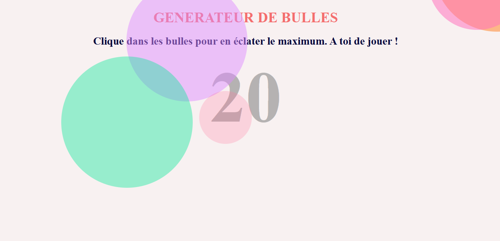

# Generateur-de-bulles

Un jeu en HTML, CSS et JavaScript où l'on doit le plus vite éclater le plus de bulles.

## Fonctionnalités

- **Eclater des bulles**

## Technologies utilisées

- **HTML** : Structure de la page
- **CSS** : Design et mise en forme
- **TypeScript** : Logique et lien des pages
